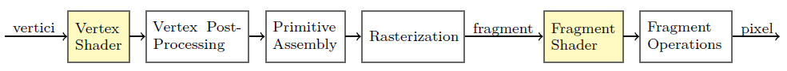
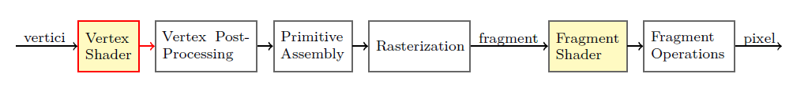
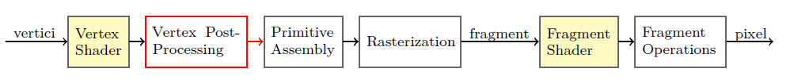
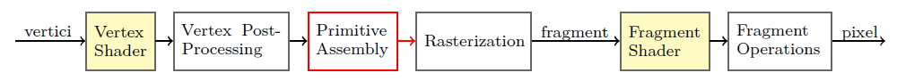
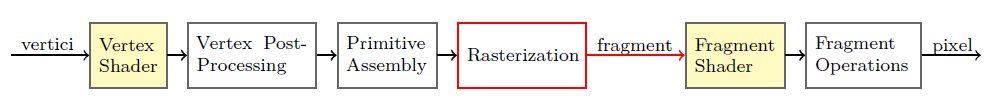
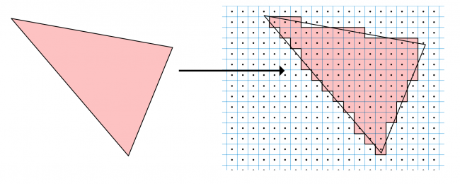
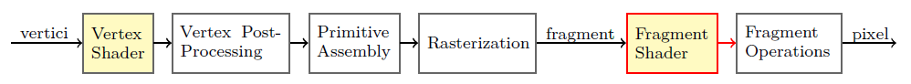
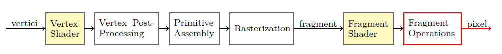
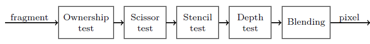

# Shader Intro

by [Chosko](https://chosko.com)

---

## Premise

The informations contained in these slides are *intentionally simplified* and *sometimes inaccurate* in order to expose the concepts as easy as possible.

===

## Summary

* **Question time**
* Real-time rendering
* The rendering pipeline
* Rendering in Unity
* Further reading

===

# Question Time

---

## What is a shader?

 
A shader is a small **program** or set of algorithms that determines how 3D **surface properties** of objects are rendered, and **how light interacts** with the object within a 3D computer program. 

A shader is a **program** that runs on **GPU**.

---

## Why on GPU?

<iframe width="560" height="315" src="https://www.youtube.com/embed/-P28LKWTzrI" frameborder="0" allow="autoplay; encrypted-media" allowfullscreen></iframe>

---

## What kinds of shader exist?

<ul class="fragment" data-fragment-index="1">
    <li>vertex shader</li>
    <li>fragment shader</li>
    <li>surface shader  *- it's a Unity abstraction*  </li>
    <li>geometry shader</li>
    <li>audio shader  *- it's a ShaderToy abstraction* </li>
    <li>tessellation shader</li>
    <li>compute shader</li>
</ul>

---

## What can shaders do?

<iframe width="640" height="360" frameborder="0" data-src="https://www.shadertoy.com/embed/XsXXDn?gui=true&t=10&paused=true&muted=false" allowfullscreen></iframe>

---

## What can shaders do?

<iframe width="640" height="360" frameborder="0" data-src="https://www.shadertoy.com/embed/4dcGW2?gui=true&t=10&paused=true&muted=false" allowfullscreen></iframe>

---

## What can shaders do?

<iframe width="640" height="360" frameborder="0" data-src="https://www.shadertoy.com/embed/Ms2SD1?gui=true&t=10&paused=true&muted=false" allowfullscreen></iframe>

---

## What can shaders do?

<iframe width="640" height="360" frameborder="0" data-src="https://www.shadertoy.com/embed/Xds3zN?gui=true&t=10&paused=true&muted=false" allowfullscreen></iframe>

---

## What can shaders do?

<iframe width="640" height="360" frameborder="0" data-src="https://www.shadertoy.com/embed/XtlSD7?gui=true&t=10&paused=true&muted=false" allowfullscreen></iframe>

---

## How to use shaders...

...in a **convenient** way?

===

## Summary

* Question time
* **Real-time rendering**
* The rendering pipeline
* Rendering in Unity
* Further reading

===

# Real-time rendering

---

## Rendering of a frame

---

## Rendering of a frame

<ul>
    <li class="fragment">The rendering of a frame is entirely made by a sequence of **draw calls**</li>
    <li class="fragment">A draw call transforms a set of **vertices** (usually a mesh) into a set of colored **pixels** that are **merged** into the frame.</li>
    <li class="fragment">It is a *complex* operation, made of a **sequence** of *tiny, specific operations*</li>
    <li class="fragment">This sequence of simple operations is organized into a pipeline: the **Rendering Pipeline**</li>
</ul>

===

## Summary

* Question time
* Real-time rendering
* **The rendering pipeline**
* Rendering in Unity
* Further reading

===

# The Rendering Pipeline

---

## The Rendering Pipeline

<ul class="font-size-80">
    <li class="fragment">It's a sequence of operations or **stages**</li>
    <li class="fragment">
        It's a **pipeline** (don't you say?)
        <ul>
            <li class="fragment">Each stage transforms **input** data into **output** data</li>
            <li class="fragment">The output of a stage is the input for the next stage</li>
            <li class="fragment">The stages work **in parallel** on different objects</li>
        </ul>
    </li>
    <li class="fragment">It's implemented in the hardware of the **GPU**</li>
    <li class="fragment">Some stages are **programmable** with **shaders**</li>
    <li class="fragment">Each stage is also **parallel** internally</li>
<ul>

---

### Vertices and Coordinate Systems

Vertices are made of **attributes**

<ul class="fragment" data-fragment-index="1">
    <li>Position</li>
    <li>Normal</li>
    <li>Tangent</li>
    <li>Texture Coordinate (UV)</li>
    <li>Color</li>
</ul>

---

### Vertices and Coordinate Systems

From vertices to pixels... we have a problem!

<ul>
    <li class="fragment">Vertices are defined in a **3D space**, centered on the pivot of the object</li>
    <li class="fragment">Pixels are positioned on a **2D space**, centered on a corner of the screen</li>
    <li class="fragment">Vertex attributes must be **transformed**!</li>
</ul>

<!-- ### Vertices and Coordinate Systems

<table class="font-size-60">
    <thead>
        <tr>
            <th>Space Name</th>
            <th>Dim</th>
            <th>Origin</th>
            <th>Example</th>
        </tr>
    </thead>
    <tbody>
        <tr>
            <td class="fragment highlight-red" data-fragment-index="1">Object space</td>
            <td>3D</td>
            <td>Object pivot</td>
            <td>Vertices</td>
        </tr>
        <tr>
            <td class="fragment highlight-red" data-fragment-index="1">World space</td>
            <td>3D</td>
            <td>World's origin</td>
            <td>All the objects of a scene</td>
        </tr>
        <tr>
            <td class="fragment highlight-red" data-fragment-index="1">Camera space</td>
            <td>3D</td>
            <td>Camera position</td>
            <td></td>
        </tr>
        <tr>
            <td class="fragment highlight-red" data-fragment-index="1">Clip space</td>
            <td>3D</td>
            <td></td>
            <td>Camera space projected onto a unit cube</td>
        </tr>
        <tr>
            <td class="fragment highlight-red" data-fragment-index="1">Screen space</td>
            <td>2D</td>
            <td>Screen corner</td>
            <td>Pixels</td>
        </tr>
        <tr>
            <td>Texture space</td>
            <td>2D</td>
            <td>Texture corner</td>
            <td>UV vertex attributes</td>
        </tr>
        <tr>
            <td>Tangent space</td>
            <td>3D</td>
            <td>Vertex</td>
            <td>Normal maps</td>
        </tr>
    </tbody>
</table> -->

---

### Vertices and Coordinate Systems

---

### Vertex shader

It's a **program** that processes input **vertices** and outputs modified **vertices**

The vertices of a mesh are processed **in parallel**!

---

### Vertex shader

Typical operations on a VS

* Transform vertex position from **object space** to **clip space**
* Transform other attributes from **object space** to **world space**
* UV tiling and offset
* Move vertices (ocean waves, cloths, wind)

---

### Vertex shader

---

### Vertex post-processing

Vertices are now in **clip space**.

* **Clipping**: remove vertices outside the clip volume
* Transform vertices from **clip space** to **screen space**

---

### Vertex post-processing

---

### Primitive assembly

* Organize the vertices in **primitives** (usually triangles)

---

### Rasterization

* Transform **vector graphics** into **raster graphics**

---

### Rasterization

* Input: a **primitive** (usually a triangle)
* Output: many **fragments**

---

### Rasterization

* Attributes of vertices are **interpolated** into attributes of fragments

---

### Fragment Shader

It's a **program** that gives a **color** and a **depth** to each fragment

---

### Fragment Shader

Typical operations on a FS

* Texturing
* Lighting
* Normal mapping
* Reflections, refractions
* A ton of other techniques

---

### Fragment Operations

It's a stage made of some sub-stages

===

## Summary

* Question time
* Real-time rendering
* The rendering pipeline
* **Rendering in Unity**
* Further reading

===

# Rendering in Unity

---

## Rendering in Unity

The Rendering Pipeline in Unity is configured by Components and Assets.

<ul>
    <li class="fragment">**MeshRenderer**</li>
    <ul>
        <li class="fragment">Invokes a **draw call** at each frame</li>
        <li class="fragment">Provides the **vertices** to the rendering pipeline</li>
        <li class="fragment">Uses other Components to configure the rest of the pipeline</li>
    </ul>
</ul>

---

<ul>
    <li>**Transform** of the object</li>
    <ul>
        <li class="fragment">Describes the object's position in **world space**</li>
        <li class="fragment">Defines the **modeling transformation**</li>
    </ul>
</ul>

---

<ul>
    <li class>**Camera**</li>
    <ul>
        <li class="fragment">Defines the **projection transformation**</li>
    </ul>
</ul>

---

<ul>
    <li>**Transform** of the camera</li>
    <ul>
        <li class="fragment">Describes the **camera space**</li>
        <li class="fragment">Defines the **camera transformation**</li>
    </ul>
</ul>

---

<ul>
    <li>A **Material** provides:</li>
    <ul>
        <li class="fragment">A **vertex shader**</li>
        <li class="fragment">A **fragment shader**</li>
        <li class="fragment">Some **shader prameters**</li>
        <li class="fragment">A **rendering queue**</li>
        <li class="fragment">Configurations for the **fragment operations**</li>
    </ul>
</ul>

===

## Summary

* Question time
* Real-time rendering
* The rendering pipeline
* Rendering in Unity
* **Further reading**

===

# Further reading

---

## Further reading

* Rendering Pipeline
    * Mathematics for 3D Game Programming and Computer Graphics - Third Edition - Eric Lengyel - Chapter 1
    * [My thesis](https://www.dropbox.com/s/egvywh1eayqken3/thesis.pdf?dl=0) - Chapter 2 
* Fragment shaders
    * [The Book of Shaders](https://thebookofshaders.com/) - an online interactive book
    * [ShaderToy](https://www.shadertoy.com) - Build and share your best shaders with the world and get inspired